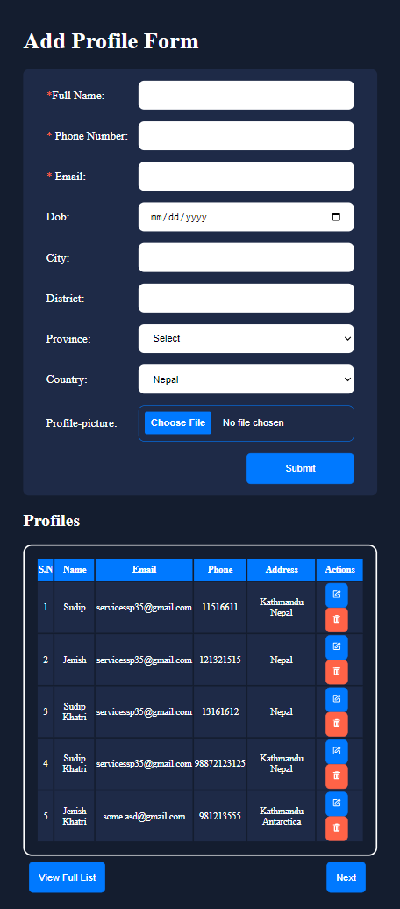
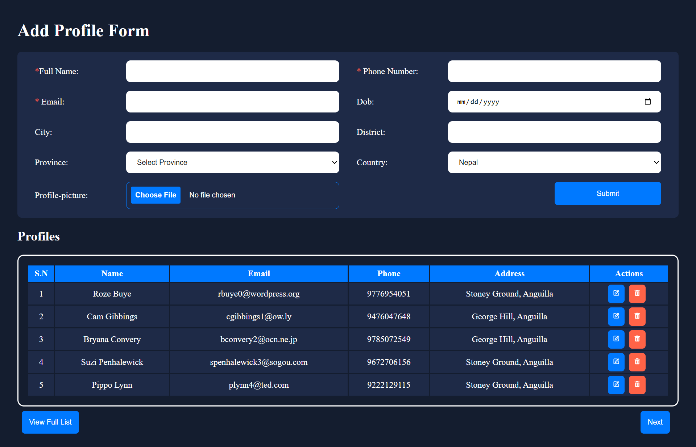

# CRUD-Add Profile App

## Table of contents

- [Overview](#overview)
  - [The challenge](#the-challenge)
  - [Screenshot](#screenshot)
  - [Links](#links)
- [My process](#my-process)
  - [Built with](#built-with)
  - [What I learned](#what-i-learned)
  - [Useful resources](#useful-resources)
- [Author](#author)
- [Features Implementd](#features-implemented)

## Overview

### The challenge

Users should be able to:

- Enter multiple entries from a form with the following data:
  - Name, email, phone number, dob, address(city,district,province),province, country by fetching countries from Api: (https://restcountries.com/v3.1/all), add/upload profile picture
- Get validation for name, email, phone number and is required
- Able to add "png" only else get validation
- Show result inside table
- See only 5 data perpage if data is greater 5 user need to go to next page to see other data

### Screenshot

### Links

- Live Site URL: [https://crudprofileapp.netlify.app/](https://crudprofileapp.netlify.app/)

## My process

### Built with

- React
- Fromik
- YUP Validation
- Axios
- React Router DOM
- React Toastify
- React Icons
- Flexbox
- CSS Grid
- Media query

### What I learned

In this project i sharpened my knowledge of managing state, improved folder structure , using formik, Yup validation, Debugging, Handling Data and problem solving.

### Useful resources

- [Stack OverFlow](https://stackoverflow.com/)
- [MDN Web Docs](https://developer.mozilla.org/en-US/)
- [W3 Schools](https://www.w3schools.com/)
- [ChatGpt](https://chatgpt.com/)

## Author

- Website - [@SudipKhatri](https://sudipkhatri.netlify.app/)
- Linkedin - [@SudipKhatri](https://www.linkedin.com/in/sudip-khatri-a72a6a27b/)

## Features Implemented

- User can enter multiple details in form with getting live validation
- User can edit, upadte and delete profile details
- Pagination features implemented
- User can view full form in on page
